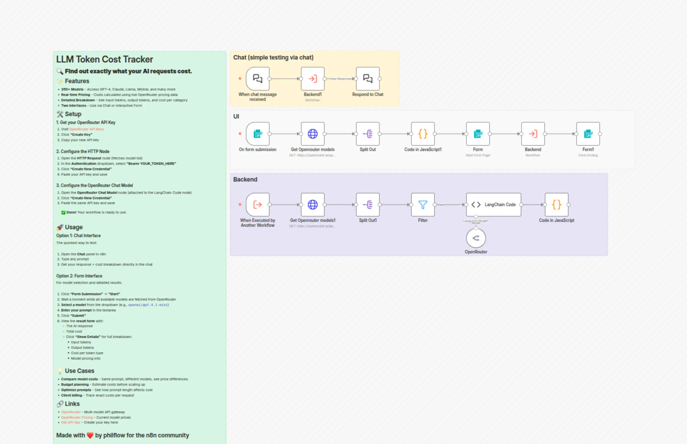

# Compare LLM token costs across 350+ models with OpenRouter

Advanced n8n automation for Compare LLM token costs across 350+ models with OpenRouter.

## Overview
- Category: Engineering, AI Chatbot
- Complexity: advanced
- Source: n8n workflow template export

## What This Automation Does
n8n template to test prompts across 350+ OpenRouter LLMs and see exact per-request costs with live pricingcompare models, optimize spend, bill clients.

## Included Files
- `workflow.json`
- `metadata.json`

## Setup
1. Import `workflow.json` into n8n.
2. Configure required credentials for the services used in the workflow nodes.
3. Update any environment variables or static values inside nodes (API keys, URLs, IDs).
4. Run a test execution and then activate the workflow.

## Tech Stack

- `@n8n/n8n-nodes-langchain.chat`
- `@n8n/n8n-nodes-langchain.chatTrigger`
- `@n8n/n8n-nodes-langchain.code`
- `@n8n/n8n-nodes-langchain.lmChatOpenRouter`
- `n8n-nodes-base.code`
- `n8n-nodes-base.executeWorkflow`
- `n8n-nodes-base.executeWorkflowTrigger`
- `n8n-nodes-base.filter`
- `n8n-nodes-base.form`
- `n8n-nodes-base.formTrigger`
- `n8n-nodes-base.httpRequest`
- `n8n-nodes-base.splitOut`
- `n8n-nodes-base.stickyNote`

## Author

Murtaza Baig

## License
MIT License. See `LICENSE`.